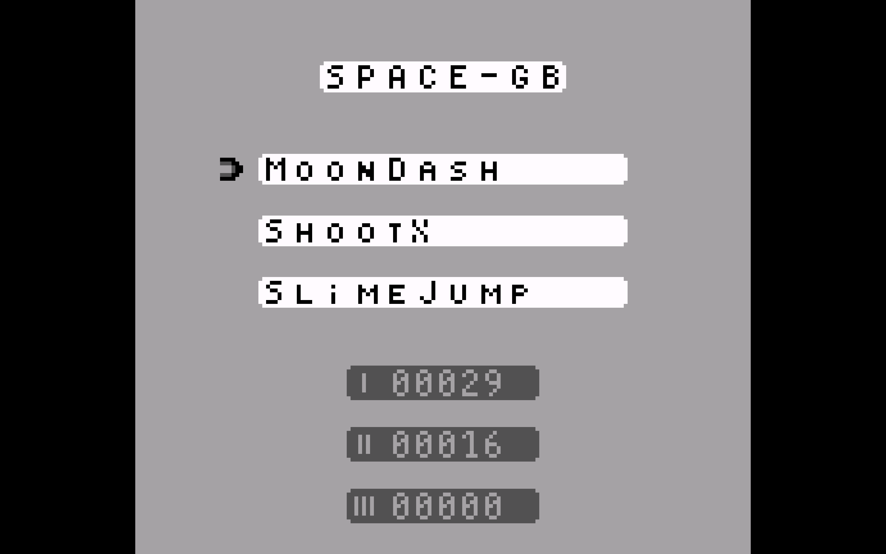
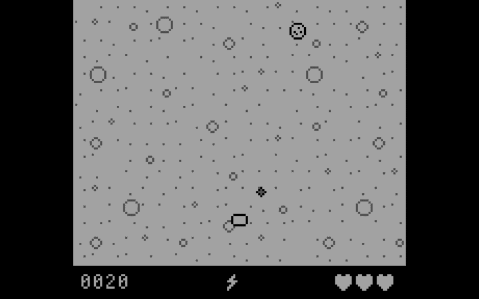
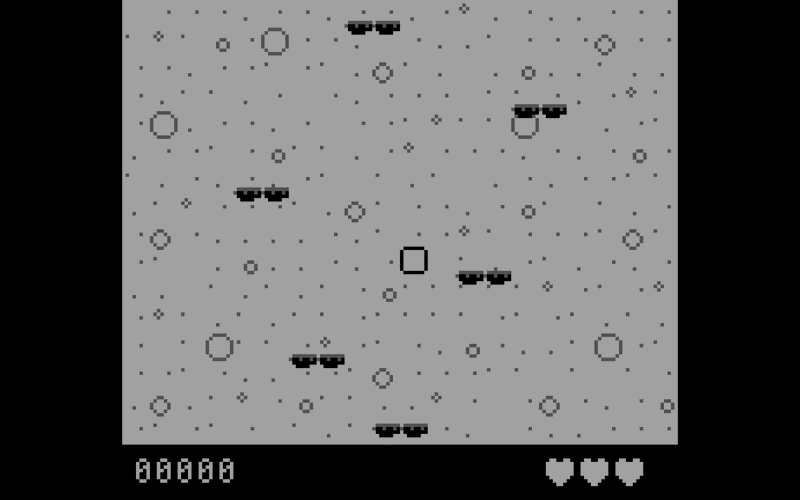

# Cartridge (v0.1)

### Preview

 \
Space-GB Menu

 \
MoonDash preview

 \
ShootX preview

 \
SlimeJump preview


### Development

By *Ariel Amriou*(ariel.amriou@epitech.eu), *Pierrick Simon*(pierrick.simon@epitech.eu) & *Sandes Savarimuthu*(sandes.savarimuthu@epitech.eu).

## Objective

Create three differents games that will be play on the original gameBoy

## Getting Started

### Prerequisites

This project requires the following dependencies:

- **Programming Language:** C
- **Tool Kit:** GBDK
- **Emulator:** Retroarch

### Installation for Linux

1. **Clone the repository:**

```sh
git clone git@github.com:EpitechPGE2-2025/G-ING-401-PAR-4-1-cartridge-12.git
```

2. **Navigate to the project directory:**

```sh
cd G-ING-401-PAR-4-1-cartridge-12
```

3. **install dependencies:**

```sh
# to compile the src file into a .gb executable
make
# to launch the game directly on the emulator libretro.RetroArch using flatpack
make run
```
